!SLIDE bullets
# frp w/ js #
* juha paananen @raimohanska

!SLIDE center
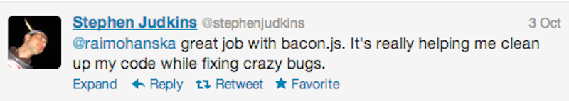

!SLIDE code

    managers = new ArrayList<Employee>()
    for (int i = 0; i < employees.size(); i++) {
      Employee e = employees.get(i);
      if (e.title.equals("manager")) {
        managers.add(e);
      }
    }
    return managers;

!SLIDE code

    filter ((== "manager") . title) employees

!SLIDE bullets incremental
#fp - lists
* filter, map, fold, zip, flatMap

!SLIDE bullets incremental
#frp - events
* filter, map, scan, merge, combine, flatMap

!SLIDE bullets incremental
#bacon.js

!SLIDE center
#EventStream

!SLIDE center
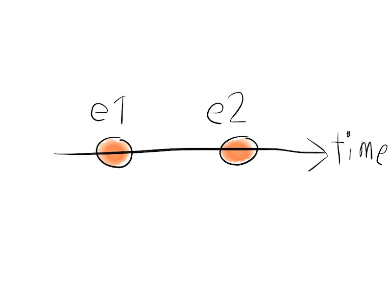

!SLIDE center
#Property

!SLIDE center
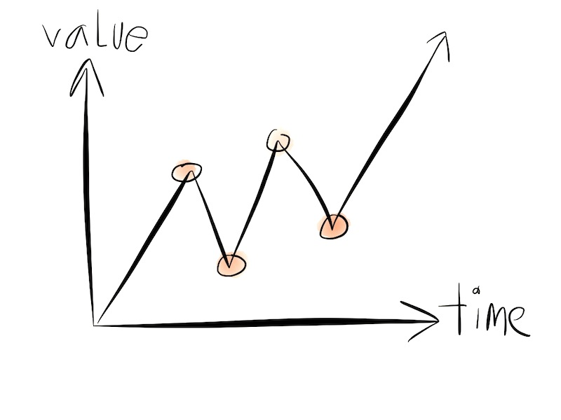

!SLIDE bullets
* mouseClicks :: EventStream
* mouseButtonState :: Property

!SLIDE center
#API

!SLIDE center
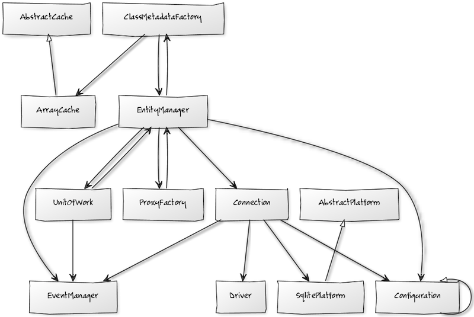

!SLIDE center
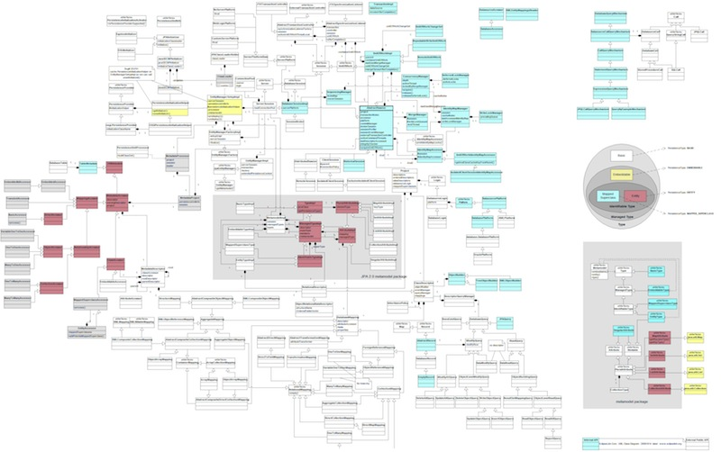

!SLIDE center
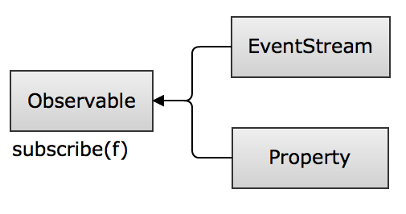

!SLIDE center
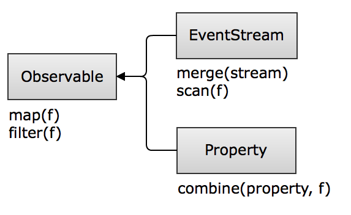

!SLIDE center
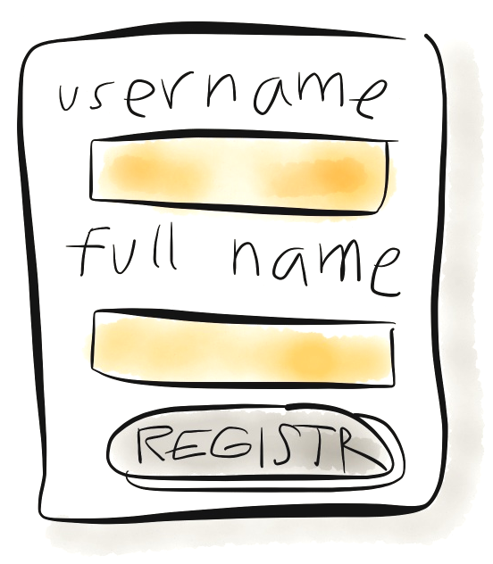

!SLIDE center
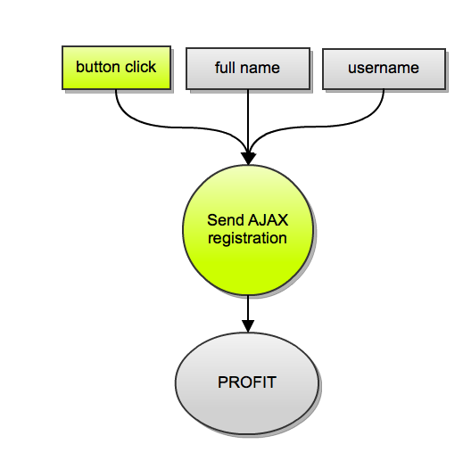

!SLIDE center

!SLIDE center
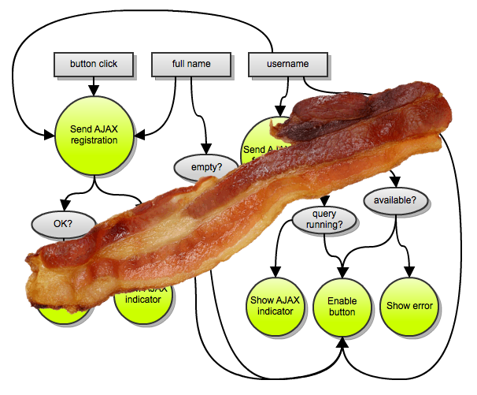

!SLIDE center
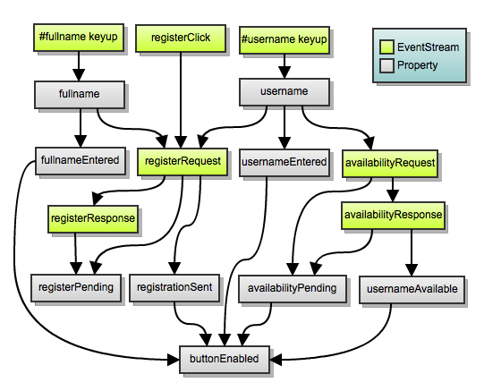

!SLIDE center

!SLIDE
#let's get started

!SLIDE
#ready? get the code!

!SLIDE
ssh://git@git.reaktor.fi/public/jpaanane/bacon-devday-code

!SLIDE
#wrap it up

!SLIDE
#@raimohanska
