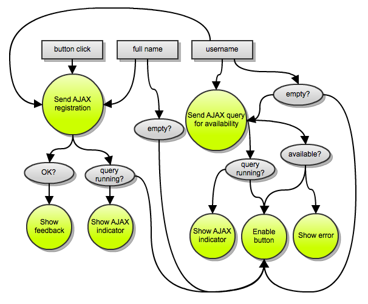

!SLIDE bullets
# frp w/ js #
* juha paananen @raimohanska

!SLIDE code

    managers = new ArrayList<Employee>()
    for (int i = 0; i < employees.size(); i++) {
      Employee e = employees.get(i);
      if (e.title.equals("manager")) {
        managers.add(e);
      }
    }
    return managers;

!SLIDE code

    filter ((== "manager") . title) employees

!SLIDE bullets incremental
#fp - lists
* filter, map, fold, zip, flatMap

!SLIDE bullets incremental
#frp - events
* filter, map, scan, merge, combine, flatMap

!SLIDE bullets incremental
#bacon.js

!SLIDE bullets incremental
#EventStream
* Observer
* filter, map, scan, merge, flatMap, toProperty

!SLIDE
#Property

!SLIDE
#value-as-function-of-time

!SLIDE
#Observer

!SLIDE
#current value + changes

!SLIDE bullets
* mouseClicks :: EventStream
* mousePos :: Property

!SLIDE center

!SLIDE center

!SLIDE center

!SLIDE center

!SLIDE
#let's get started

!SLIDE bullets
#Get the code (TODO URL)
* Try the username property

!SLIDE bullets
#Disable submit button while username missing

!SLIDE bullets
* usernameMissing :: Property
* usernameMissing.onValue(..)

!SLIDE
# Disable also if full name missing

!SLIDE bullets
* fullname :: Property
* fullnameMissing :: Property
* Property.or

!SLIDE
# Query for username availability

!SLIDE bullets incremental
* AJAX GET /usernameavailable/username
* username.changes().map(..).ajax()
* usernameAvailable :: Property

!SLIDE
# Disable button if username unavailable

!SLIDE bullets
* Property.not()
* Property.or()

!SLIDE
# Show error if username unavailable

!SLIDE bullets center
* jQuery.toggle
* id = username-unavailable

!SLIDE
# Show AJAX indicator

!SLIDE bullets center
* `#username .ajax`

!SLIDE
# Disable button when AJAX

!SLIDE
# registrationClick stream

!SLIDE bullets center
    .do(".preventDefault")

!SLIDE
# registrationRequest stream

!SLIDE bullets incremental
* Values passed to jQuery.ajax
* Bacon.combineTemplate
* sampledBy(registrationClick)

!SLIDE
# Send registration

!SLIDE bullets
* AJAX POST /register
* `#result`
